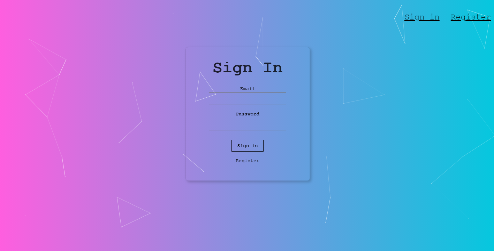
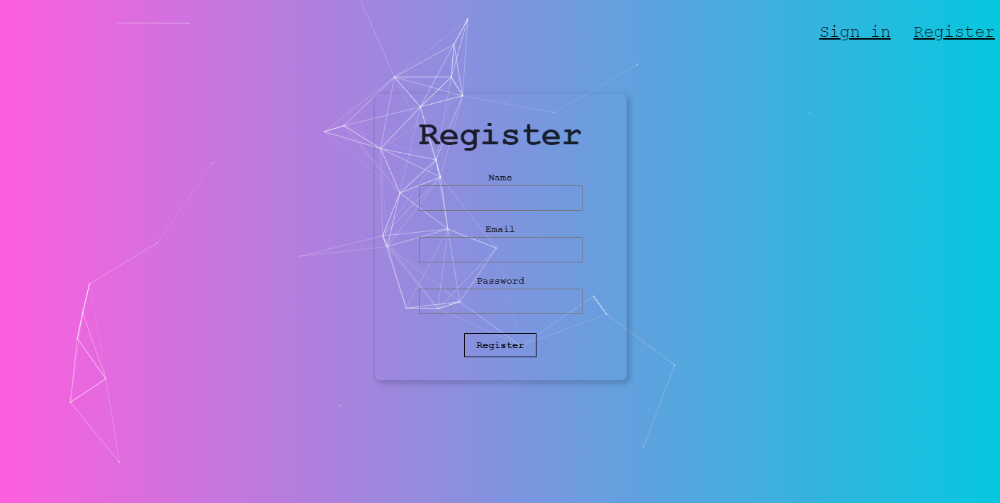
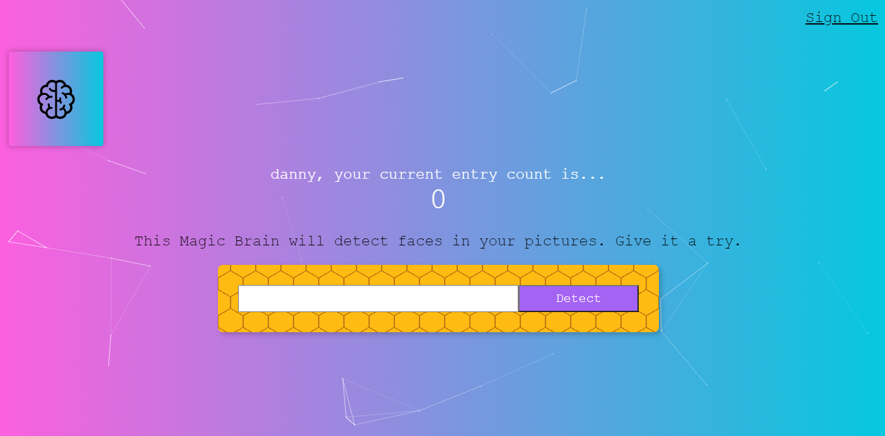
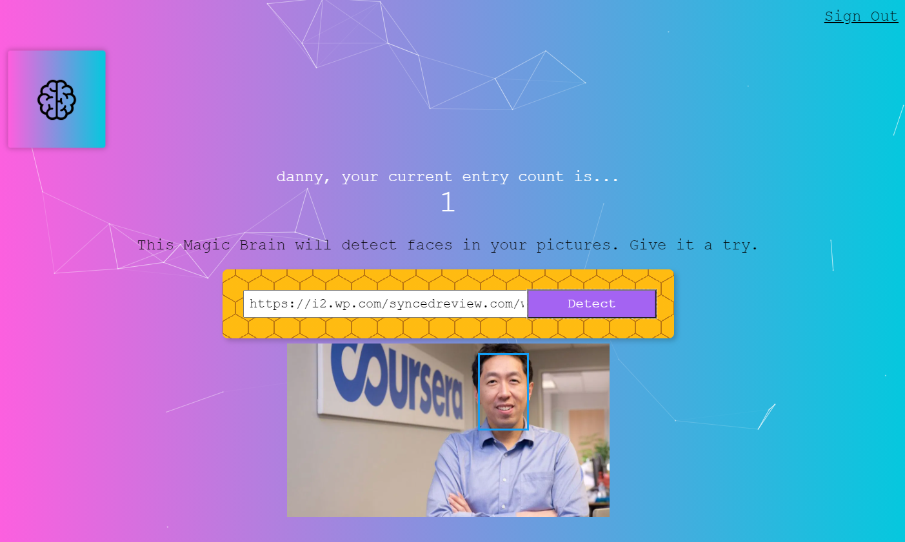

# Face-Detection-Website

A full-stack web application which applies Clarifai API to detect the position of a face in an image by URL.

Utilized React, NodeJS, and PostgreSQL to build this project and hosted on Heroku. 

Website Link: <a>https://smart-brain-400.herokuapp.com/</a> 

Backend set up on <a>https://warm-ocean-89197.herokuapp.com/</a>

<h2>Possible Improvements</h2>
<ol>
  <li>Add a profile page in the nav bar after signing in to the home page.</li>
  <li>Add update profile info and delete account option.</li>
  <li>Enable multiface detection by studying Clarifai API in detail.</li>
  <li>Show user's history of uploaded images.</li>
</ol>

<h2>Screenshots</h2>

</img>
</img>
</img>
</img>

